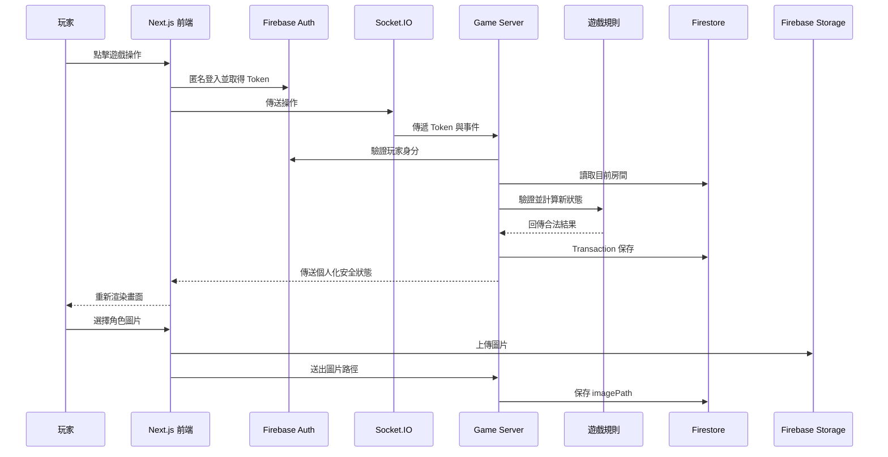
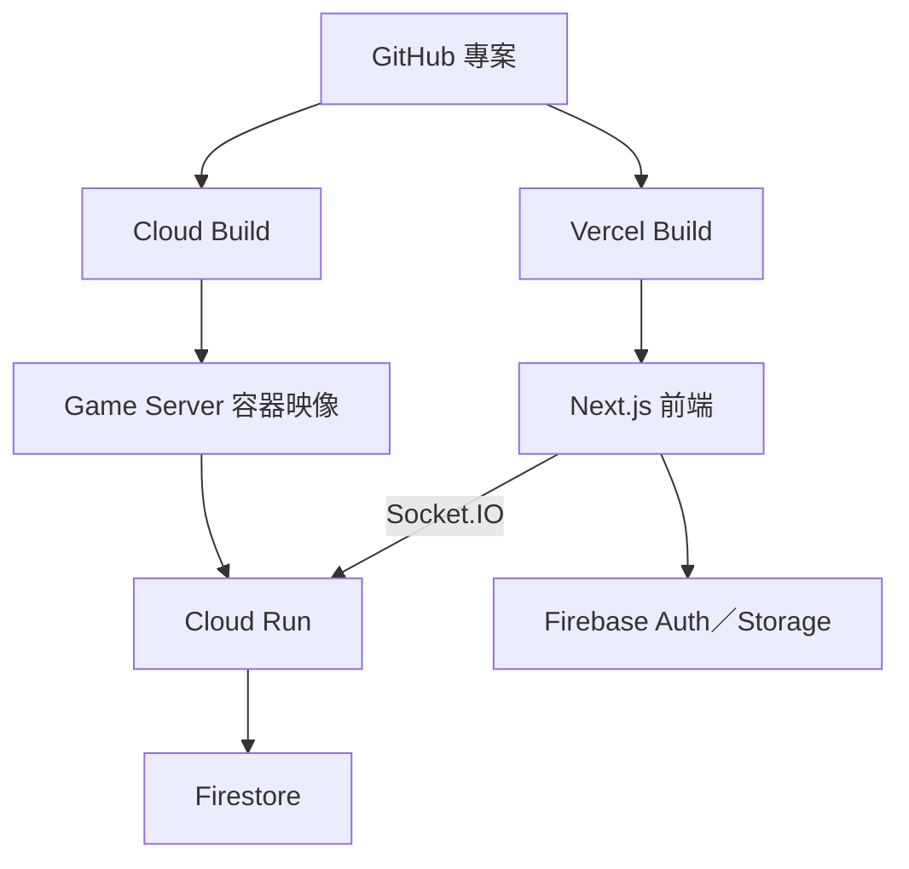

# GuessWho 專案系統性學習指南

這份文件是 `更新版guessWho` 的學習地圖，用來協助具備前端、後端與資料庫架構基礎，但還不熟悉完整專案程式碼的學習者，依固定順序理解整個系統。

學習目標不是背完每一行程式碼，而是能回答：

1. 一個檔案為什麼存在。
2. 它接收什麼資料、輸出什麼資料。
3. 是誰呼叫它，它又呼叫誰。
4. 一個使用者操作如何穿過前端、後端與資料庫。
5. 發生錯誤時，應該從哪一層開始檢查。

---

## 如何呼叫 Codex 進行教學

在新的對話或後續訊息中，可以直接使用以下說法：

```text
請依照 LEARNING_GUIDE.md，從第 1 章開始教我。
```

未另外指定範圍時，Codex 每次只教一個「教學單位」，不會一次講完整章。

```text
請依照 LEARNING_GUIDE.md，從單位 1-1 開始教我；結束後出觀念題，等我回答。
```

```text
請依照 LEARNING_GUIDE.md，教我第 5 章的 room.tsx。
```

```text
請繼續 LEARNING_GUIDE.md 上次的進度，先複習上一節，再進入下一節。
```

```text
請依照 LEARNING_GUIDE.md，帶我追蹤一次 game:guess 的完整資料流。
```

如果需要調整難度，可以補充：

```text
這一節請多解釋 TypeScript 語法。
```

```text
這一節先講架構，不要逐行解釋。
```

```text
這一節請讓我先回答問題，再公布答案。
```

---

## 固定教學方法

每次只學一個教學單位。教學單位是一次能完整理解的一個核心主題，通常包含一至三個緊密相關的檔案，預計花費約 `30～60` 分鐘。除非學習者主動要求，不一次解釋完整章或同時跨越多個單位。

一章不一定等於一次教學：簡單章節只有一個單位，前端、後端、資料庫或部署等較大的章節會拆成二至四個單位。本指南共規劃 `35` 個教學單位。

### 每堂課的固定流程

1. **一句話定位**：說明這個檔案或觀念在整個系統的用途。
2. **先看位置**：指出它位於前端、後端、共用契約、資料庫、安全、測試或部署哪一層。
3. **畫出流程**：用 Mermaid 或簡短箭頭圖表示輸入、處理和輸出。
4. **閱讀真實程式碼**：引用實際檔案與行號，分段解釋，不一次貼出整個大檔案。
5. **對應遊戲情境**：使用房間、玩家、卡牌、回合、猜測或斷線作為例子。
6. **說明技術觀念**：補充 React、Next.js、Socket.IO、Transaction 或型別系統等底層概念。
7. **動手驗證**：執行一個最小操作、測試或觀察，證明理解與實際行為一致。
8. **本節摘要**：留下本節心智模型與下一節銜接點。
9. **觀念題**：提出三至五題簡單問題，不立即公布答案，等待學習者作答。
10. **訂正與確認**：逐題回饋後，確認核心觀念已理解，再進入下一個單位。

### 單位結束的觀念題規則

- 每個教學單位結束必須提出 `3～5` 題。
- 題目以觀念與資料流為主，不考冷僻語法、行號或死背函式名稱。
- 題型可以包含是非題、單選題、流程排序及一至兩句短答題。
- 至少一題要使用本遊戲的實際情境，例如建立房間、選目標、猜測或斷線。
- 至少一題要確認學習者能分辨不同層的責任，例如前端、Game Server、Firestore 或 Firebase Rules。
- 提問後必須停下來等待學習者回答，不可以在同一則訊息直接附上答案。
- 學習者回答後，逐題標示「正確」「部分正確」或「需要再想想」，並用實際檔案或資料流簡短說明。
- 如果核心觀念答錯，先換一個例子解釋，再出一題更簡單的追問題；不直接跳到下一單位。
- 題目不以分數為主要目的。只要學習者能用自己的話說明本單位核心概念，就可以完成該單位。
- 完成訂正後，先詢問是否繼續下一單位；除非學習者已經要求連續教學，不自動展開新內容。

### 每個單位的回覆格式

```text
單位編號與主題
→ 本單位目標
→ 一句話定位
→ 流程圖
→ 真實檔案與程式碼
→ 遊戲情境例子
→ 最小動手驗證
→ 本單位摘要
→ 3～5 題觀念題
→ 等待學習者回答
```

### 單位拆分原則

一個主題符合下列任一情況，就應該拆成新的教學單位：

- 主要責任從前端換到後端、資料庫、安全或部署。
- 需要閱讀新的核心入口檔案。
- 資料的輸入、處理與輸出已形成一條可獨立驗證的流程。
- 同一堂課需要同時記住超過三個新的核心概念。

不要為了湊數拆分只有幾行的設定，也不要把互不相關的檔案塞在同一個單位。

### `35` 個教學單位配置

| 章節 | 單位 | 主題 |
|---|---:|---|
| 第 0 章 | `0-1` | 檔案分類、入口辨識與專案閱讀方法 |
| 第 1 章 | `1-1` | `README.md`、`agent.md` 與 `ART_DIRECTION.md` 的責任 |
|  | `1-2` | 遊戲狀態、玩家權限與完整生命週期 |
| 第 2 章 | `2-1` | Monorepo 資料夾與三個 workspace |
|  | `2-2` | npm scripts、套件相依與 TypeScript 設定繼承 |
| 第 3 章 | `3-1` | 玩家、卡牌、房間與遊戲狀態型別 |
|  | `3-2` | Socket 事件、payload 與 acknowledgment 契約 |
| 第 4 章 | `4-1` | Next.js App Router、Layout 與動態房間路由 |
|  | `4-2` | Client Component、全域樣式與 Tailwind 處理 |
| 第 5 章 | `5-1` | 首頁表單、建立房間與加入房間介面 |
|  | `5-2` | 房間狀態、條件渲染與玩家操作 |
|  | `5-3` | 共用 UI、角色圖片與裁切流程 |
| 第 6 章 | `6-1` | 展示模式、假資料與 `useDemoRoom` |
|  | `6-2` | Firebase Client、匿名登入與 Storage |
|  | `6-3` | `useLiveRoom`、Socket 生命週期與操作回應 |
| 第 7 章 | `7-1` | Game Server 啟動、健康檢查與 Token 驗證 |
|  | `7-2` | Socket 指令、統一處理流程與安全廣播 |
|  | `7-3` | 遊戲規則、狀態轉換、斷線與房主移交 |
| 第 8 章 | `8-1` | Firestore 文件結構與 `RoomAggregate` 對應 |
|  | `8-2` | Transaction、讀取、保存與子集合同步 |
|  | `8-3` | 圖片刪除、空房清理與 Server 重啟恢復 |
| 第 9 章 | `9-1` | 前端、Auth、Server 與資料隱私的四層安全 |
|  | `9-2` | Firestore Rules 與 Storage Rules |
| 第 10 章 | `10-1` | 遊戲規則單元測試 |
|  | `10-2` | Firebase Rules 測試與 Emulator |
|  | `10-3` | 整合測試、型別檢查與正式建置 |
| 第 11 章 | `11-1` | 前後端環境變數與展示／正式模式切換 |
|  | `11-2` | Next.js、PostCSS、TypeScript 與 Firebase 工具設定 |
| 第 12 章 | `12-1` | Dockerfile 與 Cloud Build |
|  | `12-2` | Cloud Run、Vercel、網址與 CORS 串接 |
|  | `12-3` | Cloud Scheduler、正式權限與部署驗證 |
| 第 13 章 | `13-1` | 建立房間、加入房間與修改卡片的完整資料流 |
|  | `13-2` | 選擇目標、準備、開始與回合的完整資料流 |
|  | `13-3` | 蓋牌、猜測、勝負與下一局的完整資料流 |
|  | `13-4` | 斷線、重連、房主移交、空房與保留房間的完整資料流 |

### 閱讀每個檔案時固定回答

1. 這個檔案為什麼存在？
2. 它的輸入是什麼？
3. 它的輸出是什麼？
4. 誰會呼叫它？
5. 它會呼叫哪些其他檔案或外部服務？
6. 拿掉它會壞掉什麼？
7. 哪些錯誤應該由這一層處理？
8. 它是否保存資料，還是只傳遞或顯示資料？

### 教學原則

- 先理解資料流，再補語法細節。
- 先讀共用型別與入口，再讀大型實作檔案。
- 前端按鈕狀態不等於後端權限控制。
- TypeScript 型別不等於執行時驗證。
- Socket.IO 是傳輸工具，不是資料庫或遊戲規則引擎。
- Firestore 是永久狀態來源，Game Server 是唯一裁判。
- 每個技術觀念都要對應到本專案的真實程式碼。
- 在理解完整資料流以前，不為了「整理」而重構程式碼。
- 除非學習者要求實作，教學階段只讀取、執行與觀察，不直接修改檔案。

---

## 專案總體心智模型



一句話版本：

> 前端負責顯示與送出操作，Socket.IO 負責即時傳話，Game Server 負責裁判，Firestore 負責永久紀錄，Storage 負責圖片。

---

## 不需要優先閱讀的檔案

以下內容主要由套件、編譯器或工具產生，不需要逐行閱讀：

```text
node_modules/
apps/web/.next/
apps/web/.next-live/
apps/game-server/dist/
*.tsbuildinfo
*-debug.log
package-lock.json
```

- `node_modules`：第三方套件內容。
- `.next`、`.next-live`：Next.js 建置與快取。
- `dist`：後端 TypeScript 編譯後的 JavaScript。
- `tsbuildinfo`：TypeScript 編譯快取。
- `debug.log`：工具執行紀錄。
- `package-lock.json`：鎖定相依套件版本；先理解用途，不逐行閱讀。

`public/assets/characters/*.svg` 屬於靜態素材，只需要選一張理解格式，不用逐張閱讀。

---

# 課程大綱

## 第 0 章：建立專案閱讀方法

### 學習目標

- 區分原始碼、設定檔、測試、靜態資源、建置產物與第三方套件。
- 學會用檔案樹找入口，而不是隨機打開最大檔案。
- 建立「輸入 → 處理 → 輸出」的閱讀習慣。

### 練習

- 將根目錄檔案分成規格、程式、測試、設定與部署五類。
- 說明為什麼不從 `room.tsx` 或 `server.ts` 第一行直接讀到底。

### 完成標準

- [ ] 能分辨哪些檔案是自己維護的原始碼。
- [ ] 能指出前端、後端、共用型別與 Firebase 設定的位置。

---

## 第 1 章：先用規格理解系統

### 主要檔案

- `README.md`
- `agent.md`
- `ART_DIRECTION.md`

### 學習內容

- `README.md`：安裝、啟動、測試、架構與部署入口。
- `agent.md`：遊戲規則、狀態、權限、資料與斷線規則。
- `ART_DIRECTION.md`：畫面、響應式、互動與視覺規範。

### 核心問題

- 遊戲有哪些狀態？
- 房主和來賓分別能做什麼？
- 為什麼遊戲中不能修改卡組？
- 哪些資料不能傳給對手？

### 練習

畫出：

```text
Lobby → Playing → Paused／Finished → Lobby
```

### 完成標準

- [ ] 不看程式碼也能說明一局遊戲的完整生命週期。
- [ ] 能分辨遊戲規格與前端美術規格。

---

## 第 2 章：理解 Monorepo 與執行入口

### 主要檔案

- `package.json`
- `tsconfig.base.json`
- `apps/web/package.json`
- `apps/game-server/package.json`
- `packages/shared/package.json`

### 學習內容

```text
更新版guessWho/
├─ apps/web/          Next.js 前端
├─ apps/game-server/  Node.js／Socket.IO 後端
└─ packages/shared/   前後端共用型別
```

- npm workspaces 如何管理三個子專案。
- 根目錄指令如何轉交到指定 workspace。
- React、Next.js、Node.js、Express 與 Socket.IO 的責任差異。
- TypeScript 設定如何在各 workspace 之間繼承。

### 練習

追蹤：

```text
npm run dev
npm run dev:server
npm run build
```

最後分別執行哪個子專案的哪個指令。

### 完成標準

- [ ] 能說明為什麼這個專案有三個 `package.json`。
- [ ] 能說明 Next.js 與 Game Server 為什麼要分開執行。

---

## 第 3 章：理解前後端共同契約

### 主要檔案

- `packages/shared/game-types.ts`
- `packages/shared/socket-events.ts`

### 學習內容

- `RoomState`、`PublicPlayer`、`Card`、`RoomStatus` 與 `CardCount`。
- `GameCommand` 與 `Acknowledgment`。
- Client Events 與 Server Events。
- TypeScript 如何限制事件名稱與 payload 結構。
- 型別檢查和執行時驗證的差異。

### 練習

選擇 `game:guess`，說明：

1. 前端傳送什麼。
2. 後端接收什麼。
3. 成功回傳什麼。
4. 失敗回傳什麼。

### 完成標準

- [ ] 能閱讀一個 Socket 事件的型別。
- [ ] 能解釋為什麼前後端要共用契約。

---

## 第 4 章：理解 Next.js 頁面入口

### 主要檔案

- `apps/web/src/app/layout.tsx`
- `apps/web/src/app/page.tsx`
- `apps/web/src/app/room/[roomId]/page.tsx`
- `apps/web/src/app/not-found.tsx`
- `apps/web/src/app/globals.css`

### 學習內容

- App Router 的檔案式路由。
- `/` 與 `/room/ABC123` 如何對應到檔案。
- `[roomId]` 動態參數。
- Layout、Page 與 Not Found 的責任。
- Server Component、Client Component 與 `"use client"`。
- 全域 CSS 與 Tailwind CSS。

### 練習

追蹤網址：

```text
http://localhost:3000/room/ABC123
```

說明 `ABC123` 如何進入 React 房間元件。

### 完成標準

- [ ] 能由網址找到對應 Next.js 頁面。
- [ ] 能分辨伺服器元件與客戶端元件。

---

## 第 5 章：理解前端元件與狀態

### 主要檔案

- `apps/web/src/components/home.tsx`
- `apps/web/src/components/room.tsx`
- `apps/web/src/components/ui.tsx`
- `apps/web/src/components/crop-editor.tsx`
- `apps/web/public/assets/characters/*.svg`

### 學習內容

- 首頁建立／加入房間表單。
- Room UI 如何對應 Lobby、Playing、Paused 與 Finished。
- React state 如何控制 Modal、卡片、表單與確認操作。
- 房主與來賓按鈕差異。
- 共用 `Button`、`Modal`、`Brand` 與 `Portrait`。
- `react-easy-crop` 的拖曳、縮放與正方形裁切流程。
- `disabled` 是介面控制，不是安全機制。

### 練習

從點擊一張卡片開始，找出：

```text
點擊事件 → selected state → Modal → 操作按鈕 → send()
```

### 完成標準

- [ ] 能說明一個 React state 如何改變畫面。
- [ ] 能找到房主、來賓與遊戲狀態的條件渲染。

---

## 第 6 章：理解展示模式與正式模式

### 主要檔案

- `apps/web/src/lib/demo.ts`
- `apps/web/src/lib/live.ts`
- `apps/web/src/lib/firebase-client.ts`

### 學習內容

```text
RoomView
├─ useDemoRoom：本機模擬資料
└─ useLiveRoom：Firebase＋Socket.IO 正式資料
```

- `NEXT_PUBLIC_DEMO_MODE` 如何切換資料來源。
- Firebase Web SDK 初始化。
- 匿名登入與 Firebase ID Token。
- Socket.IO 連線、事件、acknowledgment 與逾時。
- Storage 上傳與圖片下載網址。
- React effect 如何建立與清除連線。

### 練習

比較建立房間時：

```text
展示模式：直接導向 DEMO01
正式模式：登入 → 連 Socket → room:create → 取得房號
```

### 完成標準

- [ ] 能說明同一套 UI 如何切換兩種資料來源。
- [ ] 能說明為什麼重新整理展示模式會重設，正式模式不會。

---

## 第 7 章：理解 Game Server 如何當裁判

### 主要檔案

- `apps/game-server/src/server.ts`
- `apps/game-server/src/game-rules.ts`

### 學習內容

先理解外層流程：

```text
啟動 Express
→ 建立 Socket.IO
→ 驗證 Firebase Token
→ 接收玩家事件
→ 讀取 Firestore
→ 呼叫遊戲規則
→ 保存 Firestore
→ 廣播安全狀態
```

- `server.ts`：接收事件、驗證身分、存取資料、廣播結果。
- `game-rules.ts`：判斷建立、加入、準備、開始、回合、猜測、斷線與刪除是否合法。
- 為什麼遊戲規則不直接寫在 Socket listener 裡。
- 為什麼 Server 不能相信前端傳來的目前回合或玩家身分。

### 練習

追蹤一次：

```text
turn:end
→ Socket listener
→ updateAggregate
→ applyCommand
→ Firestore transaction
→ broadcast
```

### 完成標準

- [ ] 能分辨傳輸責任與遊戲規則責任。
- [ ] 能說明 Game Server 為什麼是唯一裁判。

---

## 第 8 章：理解 Firestore 永久狀態

### 主要檔案

- `apps/game-server/src/firebase-admin.ts`
- `apps/game-server/src/game-rules.ts`

### 學習內容

```text
rooms/{roomId}
├─ players/{uid}
├─ cards/{cardId}
├─ targets/{uid}
└─ secrets/access
```

- `createAggregate`、`readAggregate` 與 `updateAggregate`。
- Firestore 文件與程式內 `RoomAggregate` 的轉換。
- Transaction 的讀取、驗證與寫入。
- 卡片依 `cardId` 排序的原因。
- 秘密目標與房間密碼為什麼分開保存。
- 圖片為什麼只保存 `imagePath`。
- Game Server 重啟後如何由 Firestore 恢復。

### 練習

選一個房間，將程式中的 `RoomAggregate` 對應到 Firestore Console 的文件與子集合。

### 完成標準

- [ ] 能由 Firestore 文件還原一個房間狀態。
- [ ] 能解釋 Transaction 解決的競爭問題。

---

## 第 9 章：理解安全邊界

### 主要檔案

- `firebase/firestore.rules`
- `firebase/storage.rules`
- `apps/web/src/lib/firebase-client.ts`
- `apps/game-server/src/server.ts`

### 學習內容

四層控制：

1. 前端按鈕狀態：改善使用者體驗。
2. Firebase Authentication：確認使用者身分。
3. Game Server：驗證遊戲操作。
4. Firebase Rules：限制瀏覽器直接操作 Firebase。

重要區別：

```text
按鈕 disabled ≠ 權限控制
TypeScript 型別 ≠ 執行時驗證
Firebase 登入 ≠ 擁有所有資料權限
Socket 已連線 ≠ 這個操作一定合法
```

### 練習

說明使用者即使打開瀏覽器開發工具，為什麼仍不能合法修改對手秘密目標或直接宣告獲勝。

### 完成標準

- [ ] 能指出每種攻擊或錯誤應由哪一層阻擋。
- [ ] 能說明 `toRoomState` 為什麼要依接收玩家產生不同結果。

---

## 第 10 章：理解測試層次

### 主要檔案

- `apps/game-server/src/game-rules.test.ts`
- `firebase/rules.test.ts`
- `scripts/integration.mts`
- `scripts/check-preview.mjs`

### 學習內容

| 層次 | 指令 | 驗證內容 |
|---|---|---|
| 型別 | `npm run typecheck` | 前後端型別是否一致 |
| 單元測試 | `npm run test` | 遊戲規則是否正確 |
| Rules 測試 | `npm run test:rules` | Firebase 權限是否正確 |
| 整合測試 | `npm run test:integration` | Auth、Socket、Server 與 Firebase 是否一起運作 |
| 建置 | `npm run build` | 正式版本是否能編譯 |

- Arrange、Act、Assert。
- 單元測試和整合測試的差異。
- Emulator 如何避免污染正式資料。
- 「測試檔存在」「曾經通過」「現在重新執行通過」的差異。

### 練習

選一個猜測或斷線測試，將它拆成 Arrange、Act、Assert。

### 完成標準

- [ ] 能說明每一條測試指令保護哪一層。
- [ ] 能判斷一個新功能應補單元測試還是整合測試。

---

## 第 11 章：理解環境變數與工具設定

### 主要檔案

- `.env.example`
- `apps/web/.env.local.example`
- `firebase.json`
- `.firebaserc`
- `apps/web/next.config.ts`
- `apps/web/postcss.config.mjs`
- 各層 `tsconfig.json`

### 學習內容

- `.env.example` 和真正 `.env.local` 的差異。
- `NEXT_PUBLIC_*` 為什麼會進入瀏覽器。
- Server 專用設定為什麼不能放在前端。
- Emulator 的專案、服務與連接埠。
- Next.js、PostCSS、Tailwind 與 TypeScript 設定。
- 修改環境變數後為什麼需要重新啟動或建置。

### 練習

將環境變數分成：

```text
瀏覽器公開設定
後端專用設定
本機 Emulator 設定
Cloud Run 正式設定
```

### 完成標準

- [ ] 不會把 Service Account 私鑰放入 `NEXT_PUBLIC_*`。
- [ ] 能找出展示模式仍然啟用的設定原因。

---

## 第 12 章：理解部署流程

### 主要檔案

- `apps/game-server/Dockerfile`
- `cloudbuild.yaml`
- `vercel.json`
- `README.md` 的部署章節

### 學習內容



- Dockerfile 描述什麼。
- Cloud Build 如何建立容器映像。
- Cloud Run 如何執行 Game Server。
- Vercel 如何建置 Next.js。
- `WEB_ORIGIN` 與 `NEXT_PUBLIC_GAME_SERVER_URL` 如何互相對接。
- 為什麼第一版 Cloud Run 限制為一個 instance。
- Cloud Scheduler 如何觸發保留房間的清理。

### 練習

說明為什麼部署 Vercel 後，還需要將 Vercel 網址填回 Cloud Run 的 `WEB_ORIGIN`。

### 完成標準

- [ ] 能畫出瀏覽器、Vercel、Cloud Run 與 Firebase 的正式環境關係。
- [ ] 能分辨程式問題、環境變數問題與雲端權限問題。

---

## 第 13 章：按功能追蹤完整資料流

完成前面章節後，不再按資料夾學習，改成逐項追蹤真實功能：

1. 建立房間。
2. 第二位玩家加入。
3. 房主修改卡片數量。
4. 房主更新卡片名稱與圖片。
5. 玩家選擇秘密目標。
6. 來賓準備、房主開始。
7. 玩家蓋牌。
8. 玩家完成提問與結束回合。
9. 猜錯並自動切換回合。
10. 猜中並結束遊戲。
11. 玩家斷線與重連。
12. 房主斷線後移交權限。
13. 空房刪除或保留。

每個功能都用相同格式追蹤：

```text
畫面按鈕
→ React event handler
→ live.ts
→ Socket event
→ server.ts
→ game-rules.ts
→ firebase-admin.ts
→ Firestore
→ room:state
→ React 重新渲染
```

### 最終練習

不看教學答案，獨立完成「猜錯」的完整資料流圖，並指出：

- 哪裡確認目前輪到誰。
- 哪裡判斷答案錯誤。
- 哪裡切換回合。
- 哪裡保存 Firestore。
- 哪裡將結果傳給兩位玩家。
- 哪裡避免洩漏對手秘密目標。

### 完成標準

- [ ] 能自行追蹤一個尚未教過的功能。
- [ ] 遇到錯誤時能判斷應檢查前端、Socket、規則、Firestore 或 Rules。
- [ ] 能向另一位同學完整解釋這個專案的三層架構。

---

## 建議學習順序與節奏

建議每次學習一個教學單位，每單位約 `30～60` 分鐘：

```text
第 0～2 章：建立地圖
第 3～6 章：理解前端與通訊契約
第 7～9 章：理解後端、資料庫與安全
第 10～12 章：理解驗證、設定與部署
第 13 章：整合與獨立追蹤
```

每學完一個單位，至少完成一次：

1. 用自己的話重新說明。
2. 指出相關檔案。
3. 畫一張資料流圖。
4. 執行一個最小驗證。
5. 回答單位結束的三至五題觀念題。
6. 記下一個仍不理解的問題。

不要以「看完檔案」作為完成標準；要以「能用自己的話回答觀念題，並預測操作會經過哪些層」作為完成標準。

---

## 學習進度表

只有在完成觀念題與訂正後才勾選單位；章內所有單位完成後，才算完成該章。

- [ ] `0-1`：檔案分類、入口辨識與專案閱讀方法
- [ ] `1-1`：三份規格文件的責任
- [ ] `1-2`：遊戲狀態、權限與生命週期
- [ ] `2-1`：Monorepo 與三個 workspace
- [ ] `2-2`：npm scripts、相依與 TypeScript 設定
- [x] `3-1`：遊戲領域型別
- [ ] `3-2`：Socket 事件契約
- [ ] `4-1`：App Router 與動態房間路由
- [ ] `4-2`：Client Component 與樣式處理
- [ ] `5-1`：首頁與房間表單
- [ ] `5-2`：房間狀態與玩家操作
- [ ] `5-3`：共用 UI 與圖片裁切
- [ ] `6-1`：展示模式
- [ ] `6-2`：Firebase Client、Auth 與 Storage
- [ ] `6-3`：正式 Socket 連線生命週期
- [ ] `7-1`：Server 啟動與 Token 驗證
- [ ] `7-2`：Socket 指令處理與廣播
- [ ] `7-3`：遊戲規則、斷線與房主移交
- [ ] `8-1`：Firestore 結構與程式資料對應
- [ ] `8-2`：Transaction 與資料同步
- [ ] `8-3`：圖片、空房與重啟恢復
- [ ] `9-1`：四層安全與資料隱私
- [ ] `9-2`：Firestore／Storage Rules
- [ ] `10-1`：遊戲規則單元測試
- [ ] `10-2`：Firebase Rules 測試
- [ ] `10-3`：整合測試與建置
- [ ] `11-1`：環境變數與模式切換
- [ ] `11-2`：前端、TypeScript 與 Firebase 工具設定
- [ ] `12-1`：Dockerfile 與 Cloud Build
- [ ] `12-2`：Cloud Run、Vercel 與 CORS
- [ ] `12-3`：Scheduler、正式權限與部署驗證
- [ ] `13-1`：房間與卡片資料流
- [ ] `13-2`：目標、準備、開始與回合資料流
- [ ] `13-3`：蓋牌、猜測、勝負與下一局資料流
- [ ] `13-4`：斷線、房主移交與房間清理資料流

---

## 後續可以進行的正式化改善

這些不是入門閱讀的前置條件，完成相關章節後再處理：

1. 讓 Game Server 缺少正式環境變數時直接拒絕啟動。
2. 讓本機 Game Server 自動讀取自己的 `.env.local`。
3. 清除首頁固定的 `FRONTEND PREVIEW 01` 測試字樣。
4. 完整理解 `room.tsx` 後，再評估是否拆分 Lobby、Card Modal 與 Game Controls。

不要為了讓檔案看起來更小而提早拆分；只有在責任邊界已經理解，而且修改確實變得困難時才重構。


